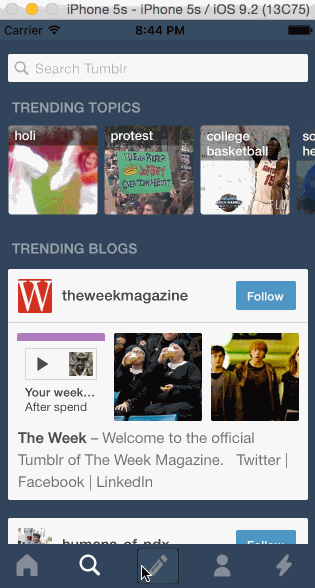

# WK3-Mailbox

This is an iOS app mimicking the Mailbox app.

Time spent: 6 hours

Completed user stories:

- Tapping on Home, Search, Account, or Trending should show the respective screen and highlight the tab bar button.
- Compose button should modally present the compose screen.
- Optional: Compose screen is faded in while the buttons animate in.
- Optional: Login button should show animate the login form over the view controller.
- Optional: Discover bubble should bob up and down unless the SearchViewController is tapped.

Walkthrough of all user stories:

